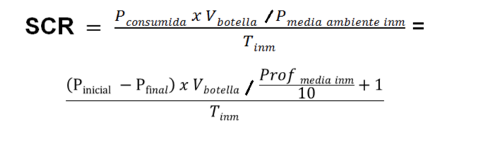

# Diving

## Objetivo

Crear una calculadora de consumo de aire para las inmersiones del buceo.

## Formula

## Setup

1. Instalar [python3](https://www.python.org/downloads/)
2. Clonar el repositorio 
   - Abrir la terminal
   - Ejecutar el siguiente comando: `git clone git@github.com:Marc-AC-93/Diving.git`

## Calcular el consumo de aire

1. Abrir la terminal (en la carpeta del proyecto)
2. ejecutar el script: `python3 calculadora.py`
3. Introducir los datos que se requieren por terminal.

Al acabar de introducir los datos te devolverá el consumo de aire basado en:
 - bares de la botella
 - litros de la botella
 - produndidad media
 - tiempo de buceo

Si el resultado es un buen ratio (0.1 - 20 bares/minutos) se devolverá en color verde, sino en rojo.